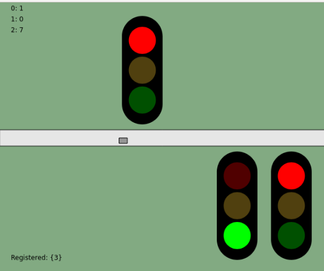

# Traffic

In this project I wanted to create a simulation of traffic that interacts with traffic lights and also where the traffic lights interact with each other via a traffic controller. 

There are still ideas to put into, but at the moment one "car" will drive from left to right and interacts with the traffic light above the road. That traffic light needs to interact with the other two traffic lights shown on the screen. 

## Example

## Run
 - clone project
 - open the index.html file in the browser
 
 on mouse click, the two traffic lights on the most right will get random numbers of 'traffic' in their corresponding queue.
 
## History
 - In the resources folder, there are more screenshots of earlier versions.

